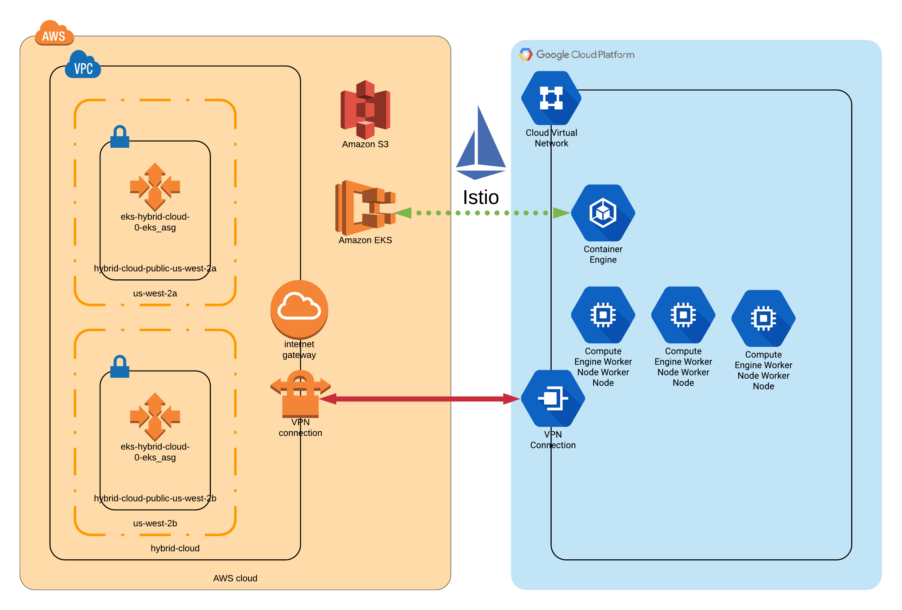
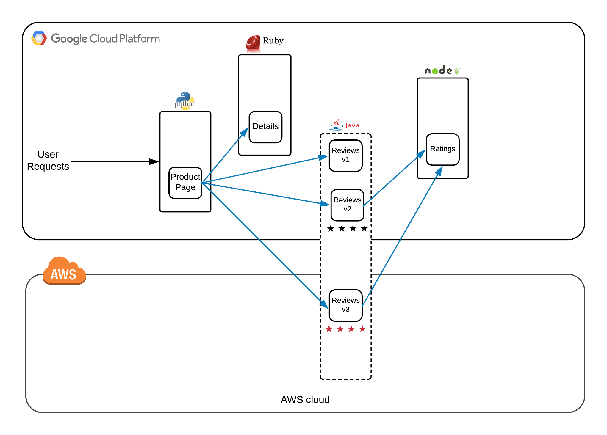

# Kubernetes Hybrid Cloud
## Building a hybrid cloud with Kubernetes and Terraform
Also hosted at https://gitlab.com/magic7s/k8s-hybrid-cloud for CI/CD capabilities.

### Requirements

Either install the requirements below or use the Dockerfile. You can also leverage gitlab CI/CD to run the container for you.

```bash
docker build -t myimage:latest .
docker run -it myimage
# git clone https://github.com/magic7s/k8s-hybrid-cloud.git
# terraform init
```

* Must have AWS kubectl available in PATH
* Must have AWS aws-iam-authenticator available in PATH
* Must have gcloud cli available in PATH
* Must have helm available in PATH
* Must install custom terrafrom plugin from https://github.com/mcuadros/terraform-provider-helm

### Environment


### Sample App - Bookinfo


### Steps to execute (assuming above requirements are meet):
```bash
# Update or delete BACKEND.tf to use local terraform.tfstate
terraform init
terraform apply
#-- An error will be thrown. See bug https://github.com/magic7s/k8s-hybrid-cloud/issues/3
terrafom apply
cd sample_app
./install_bookinfo.sh
```

_Resources_ - *This project makes use of many others contributions.*
* https://registry.terraform.io/modules/terraform-aws-modules/eks/aws/1.6.0
* https://registry.terraform.io/modules/terraform-aws-modules/vpc/aws/1.41.0
* https://registry.terraform.io/modules/terraform-aws-modules/vpn-gateway/aws/1.4.0 (code use)
* https://registry.terraform.io/modules/tasdikrahman/network/google/0.1.1
* https://registry.terraform.io/modules/tasdikrahman/network-subnet/google/0.1.1
* https://github.com/mariopoeta/terraform-google-cloudvpn-withoutbgp (code use)
* https://github.com/mcuadros/terraform-provider-helm